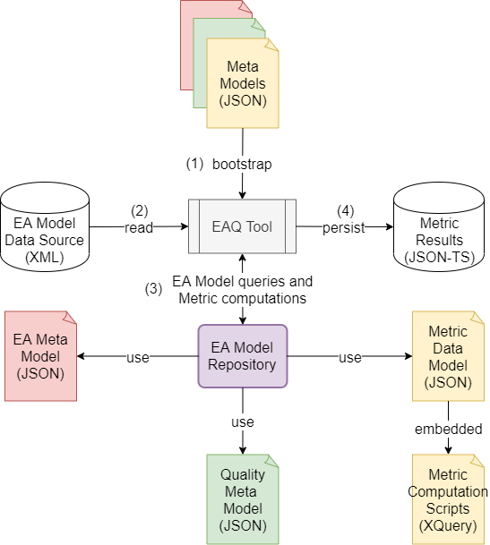
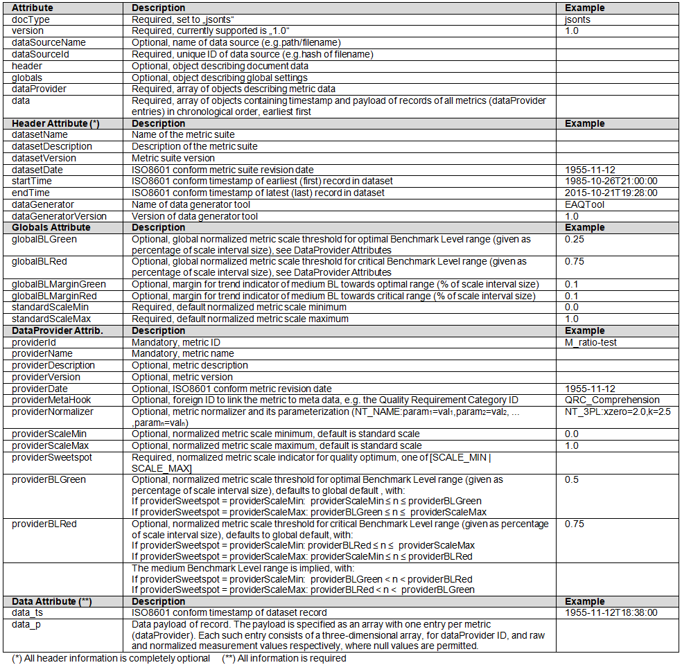
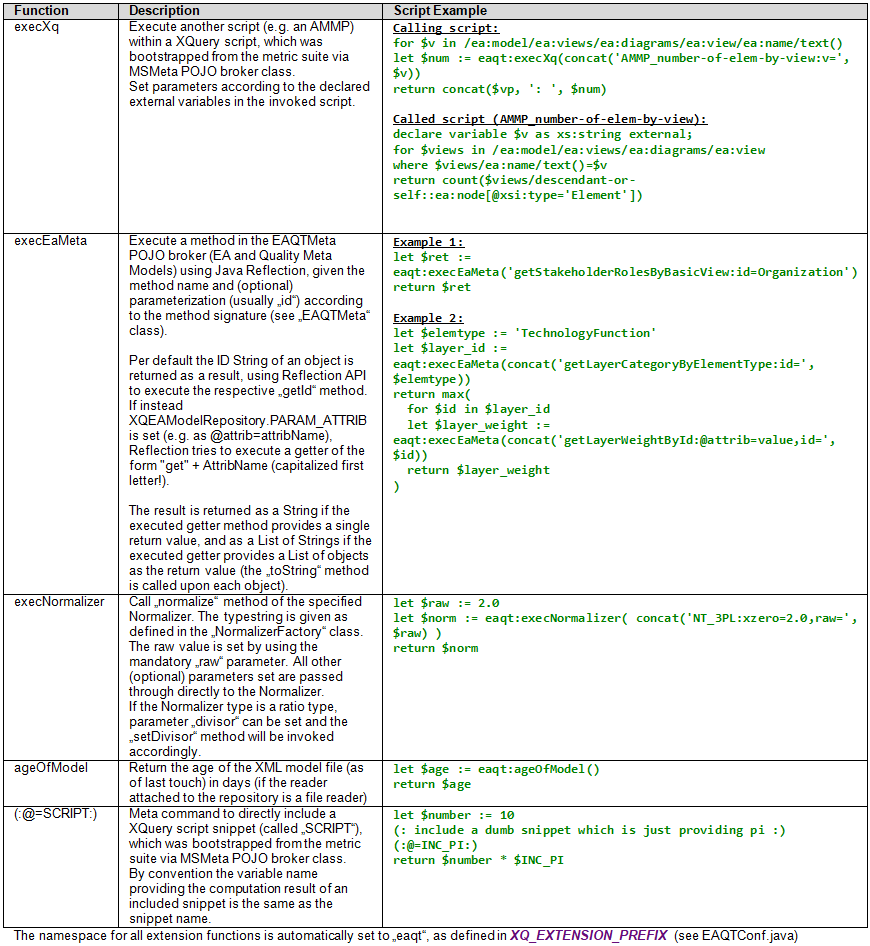
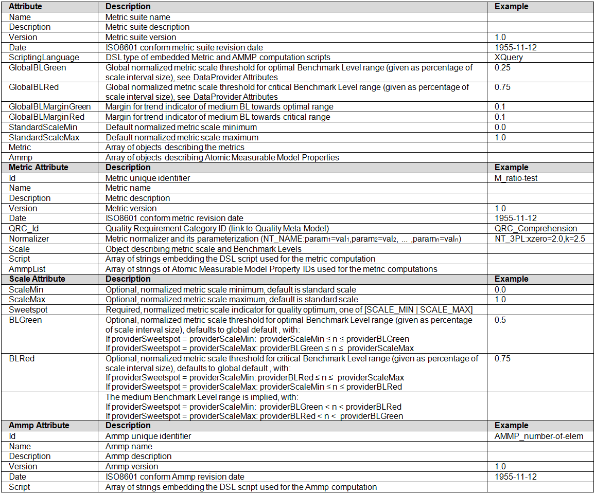
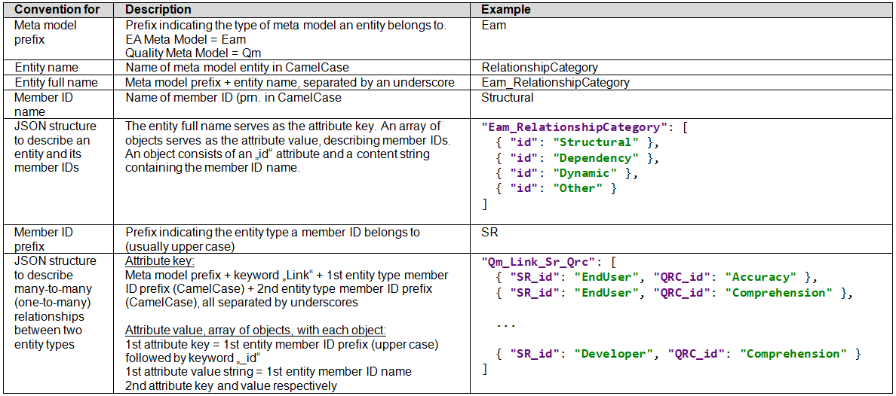

# An Automated Metric-Based Quality Framework For EA Model Assessment
## Master's Thesis Tool Implementation

#### Michael G. Beyer
##### (last edited 2021-04-20)

This project contains the (Java) source code of the tool implementation (EAQTool) for the realization part of our thesis paper. 
For a detailed description of the purpose, usage and architecture of this software and the metric suite it incorporates we refer to our thesis paper.
An API reference can be found in the "JavaDoc" folder.

###### Modification History: 
###### 2021-0420: Added: Documentation
###### 2020-0223: Minor MVC related refactoring

### EAQTool, data access layer, and JSON meta data descriptors

**EAQ Tool Principle Usage**

To support fully automated workflow, EAQTool is implemented as a commandline
interface (CLI) tool, adhering to Maven software project management. While there are defaults set for all file paths, e.g. to load
the model descriptor files (class "EAQTConf" in the root package), those paths are of
course customizable via CLI parameters. The only mandatory parameter is needed to
provide the path and filename of the XML model file that is supposed to be evaluated by
the tool (in the following referred to as the data source). For examples of data source
files see directory "src/main/resources/*.xml". \
The tool supports the following CLI commands

<pre>
usage: EAQTool
-d,--dryrun Do not persist results.
-ea,--eameta <arg> Path and filename of EA meta model.
-f,--file <arg> Path and filename of XML EA model to evaluate.
-gc,--groupingcat <arg> Grouping category for result display [QRC (default) | MQC | SR].
-m,--metrics <arg> Path and filename of metric suite.
-p,--persist <arg> Path for metric suite run result persistence.
-q,--qmeta <arg> Path and filename of quality meta model.
</pre>

If not specified by the user, the default path for result persistence is set according
to the "user.home" system property as ”$HOME/$EAQTConf.APPNAME/persist”
(the directory will be created if not there already). The file name is generated based on
the name and version of the metric suite as specified in the respective metric suite configuration
file, and the data source name without its file extension. The strings are sanitized
to file system safe characters and concatenated using underscores (see class "MetricLog",
method "buildPersistenceFilename"), e.g. "EAQToolMetrics_10_ArchiMetal.json". For
examples of persistence files see directory "src/main/resources/persist_examples".
Per default the JSON descriptor files are expected to reside below the Maven default
resources directory ("src/main/resources"), meta models under "meta/ea_meta.json" and
"meta/quality_meta.json" respectively, and the metric suite under "metric/metrics.json".
The results of a metric suite run will be displayed using the default view (a rudimentary
formatted and ANSI-colored console output to stdout, see package "view"). Results and
their respective measurement values can be grouped by Quality Requirement Category
(default), Measurable Quality Characteristic or Basic Stakeholder Role.

**General workflow of the EAQ Tool**

The principle workflow is (counterclockwise) as follows (see figure below):
1. In the first step all externalized information is bootstrapped from JSON descriptor
   files via the open Jackson deserializer API (see FasterXML [16]). The deserialization
   process is done utilizing (occasionally retrofitted) Plain old Java objects (POJOs)
   originally generated by the Open Source project ”jsonschema2pojo”, which can
   be used to generate Java types from JSON or JSON Schema and annotate those
   types for data-binding with a parser / generator library like Jackson or Gson (see
   joelittlejohn [32]).
   The information provided by the bootstrapped POJOs representing the EA Meta
   Model and the Quality Meta Model is made accessible to the host application by
   means of a broker class (EAQTMeta). The broker provides several helper methods
   to query specific information from the POJO classes, like the retrieval of lists of a
   specific entity type, the retrieval of an an entity by its ID or the retrieval of entities
   via their (many-to-many) relationship to other entity types. Information about
   the metric suite is bootstrapped from JSON and made accessible in a very similar
   fashion (MSMeta POJO broker class).
2. In the second step the EA model is read via a XML file reader which is instantiated
   via a XML reader factory.
3. In the next step a repository layer is used to query the EA model for metric
   computations. The repository makes use of the XQuery processor from the Saxon
   S9API (see Saxonica [58]). The host application channels the processing of the
   whole metrics suite via the MSMeta broker, which knows the metric suite defined
   by the bootstrapped JSON descriptor file. The metric suite aggregates all metrics
   to be run and all AMMPs (Atomic Measurable Model Properties), which define
   basic measurement functions a metric can use to perform its calculations. Those
   AMMP functions are modular and reusable and might be utilized by several different
   metrics.
   The whole computational logic is outsourced and done by XQuery scripts only,
   embedded in the formerly bootstrapped JSON metric suite definition (descriptor)
   file. By using the meta data from this definition file, each metric ”knows” which
   AMMPs it needs for measurements, and those AMMPs are directly invoked and
   parameterized within the XQuery script itself. The query is then delegated via
   S9API extension functions to the repository or to execute a method in the EA
   meta model (EAQTMeta).
   Using information provided by the meta data from the definition file, each metric
   also ”knows” the intended normalization method and its parameterization. The
   returned measurement values are processed, possibly normalized, and passed on
   upstream and eventually aggregated by the host application.
4. Finally the measurements result set of the metric suite run is timestamped and
   persisted via a factory-instantiated JSON-TS writer (JSON for time series data).
   Additionally the results are shown as a visual confirmation of the metric suite
   computation run, and formatted and written to stdout accordingly.

**Persisting and Aggregating the Result Set**

The results of a metric run should be persisted as time series data, similar to a logfile,
and in a format which is wide-spread and open, with a broad support of available APIs,
so they can be processed further by third-party tools as easily as possible. In addition it
should be a human-readable textual format, which (unlike for example XML) is quite
compact and bears only little overhead. \
Therefore we chose to implement a specialized JSON format, namely JSON-TS (JSON
for time series data, see image below), which captures and transports all the necessary information about
the metric results in a way they can be seamlessly processed and aggregated later by
a third-party tool. Besides the measurements as such (raw and normalized values),
the persisted information includes: Name and description of the metric suite, the data
source processed, information about the tool which produced the measurements (data
generator), information about each metric in the suite (data provider), an external ID to
link a metric to its Quality Requirement Category, information about the normalizer
and scaling used, as well as Benchmark Level thresholds. For a detailed description of
the JSON-TS format, see the figure below. For a Schema file to parse JSON-TS
against, we refer to [JSON_TS_Schema.json](./docs/JSON_TS_Schema.json).

**XQuery Data Access Layer**

A Saxon-based XQuery processing repository layer is used as a mediator between business
logic and data access layer, to address queries to the XML Enterprise Architecture
model data. A XML reader is attached to the Repository (in the concrete case a XML
file reader), which provides a XMLSource (StreamSource), that is transformed by the
Repository into a XDM (XQuery and XPath Data Model) context (XdmNode) by a
Saxon S9API DocumentBuilder. The XDM context is needed by the Saxon S9API to
execute XQuery queries against a XML data source. \
A Specification object (XQSpecification) is used as a means of abstraction and to encapsulate a query (XQuery script and a Hashmap of external variables used in the script) to the
Repository, which makes it more versatile. Basically the EA Data
Model is queried using a Specification built from a XQuery script (as embedded in the
JSON metric definition file), which is then passed to the query method of the XQuery
XQRepository. The Repository then utilizes the Saxon S9API to run the query against
the XML data source represented by the XDM context. It returns a XdmValue object,
the Saxon S9API representation of XDM (XQuery and XPath Data Model) values, which
is a list of zero or more typed or untyped items, representing atomic values or XML nodes. \
To learn more about the set of extension functions we have implemented in the repository
layer (class ’XQEAModelRepository’), that can be used inside XQuery queries, see the image below.

**Metric Suite Format Description (JSON)**

**Conventions for Meta Models**

